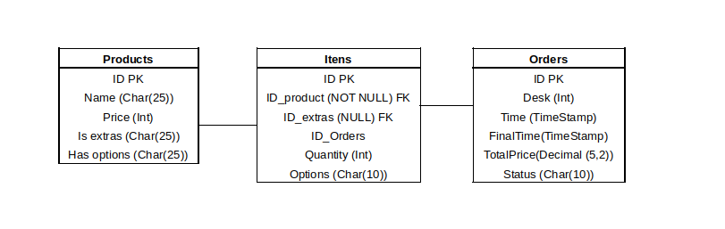

### Burguer Queen API

## Índice

* [1. O que é?](#1-o-que-é-?)
* [2. Resumo do Projeto](#2-resumo-do-projeto)
* [3. Como Utilizar](#3-como-utilizar)
* [4. Tecnologias Utilizadas](#4-tecnologias-utilizadas)
* [5. Testes Realizados](#5-testes-realizados)
* [6. Hospedagem](#6-hospedagem)
* [7. Link](#7-link)
* [8. Visão do Banco](#8-visao-do-banco)
* [9. Checklist dessa Versão](#9-checklist-dessa-versao)
* [10. Próxima Versão](#10-proxima-versao)

***
## 1. O que é?
Projeto proposto pela Laboratória. O Burger Queen é uma API rest que será compatível com as requisições vinds do Front - .

## 2. Resumo do Projeto

Ele trabalha como um servidor web, através de portas especificas, essa API enviar requisições e obter respostas, a integração ao front será por um arquivo .Json. O mesmo segue a estrutura MVC (Model View Controller), juntamente com um banco relacional "Postgres".

## 3. Como Utilizar

Será necessário a utilização do  e 

**[Utilizando o comando]**

```sh
docker-compose up 
```
Vai abrir realizado a integração ao banco e o test da aplicação

```sh
docker-compose up dev
```
Ambiente de desenvolvimento

```9
docker-compose up test
```
Ambiente de Testes

```sh
docker-compose up prod
```
Ambiente de produção

## 4. Tecnologias Utilizadas

JavaScript
Docker
Npm
NodeJs
Express
Sequelize
Postgres

## 5. Testes Realizados
Mocha & Chai
Postman

## 6. Hospedagem
Heroku
GitHub

## 7. Link 
https://burguer-queen-nery.herokuapp.com/api

## 8. Visão do Banco
Como o banco de dados foi desenha para esse projeto.

***
## 9. Checklist dessa Versão

### HTTP API

#### `/products`

* [x] `GET /products`
* [x] `GET /products/:productid`
* [x] `POST /products`
* [x] `PUT /products/:productid`
* [x] `DELETE /products/:productid`

#### `/orders`

* [x] `GET /orders`
* [x] `GET /orders/:orderid`
* [x] `POST /orders`
* [x] `PUT /orders/:orderid`
* [x] `DELETE /orders/:orderid`

#### `/tables`

* [x] `GET /tables`
* [x] `GET /tables/:tableid`
* [x] `POST /tables`
* [x] `PUT /tables/:tableid`
* [x] `DELETE /tables/:tableid`

### Testes unitários

* [x] Testes unitários para cada função utilizada externamente pela aplicação

## 10. Próxima Versão

Terá alguns _endpoints_ extras, implementação da autenticação, os testes _"end to end"_ (de uma ponta a outra), ou _e2e_.

### Checklist Próximo Versão

* [ ] Endpoint de histórico de pedidos
* [ ] Endpoint de criação de usuário
* [ ] Endpoint de alteração de usuário
* [ ] Endpoint de exclusão de usuário
* [ ] Autenticação com _JSON Web Token_ (JWT)
* [ ] Acrescentar níveis de permissão de usuário
* [ ] Testes _e2e_

**Feito por Vanessa Nery**